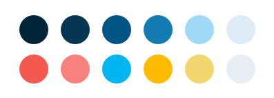
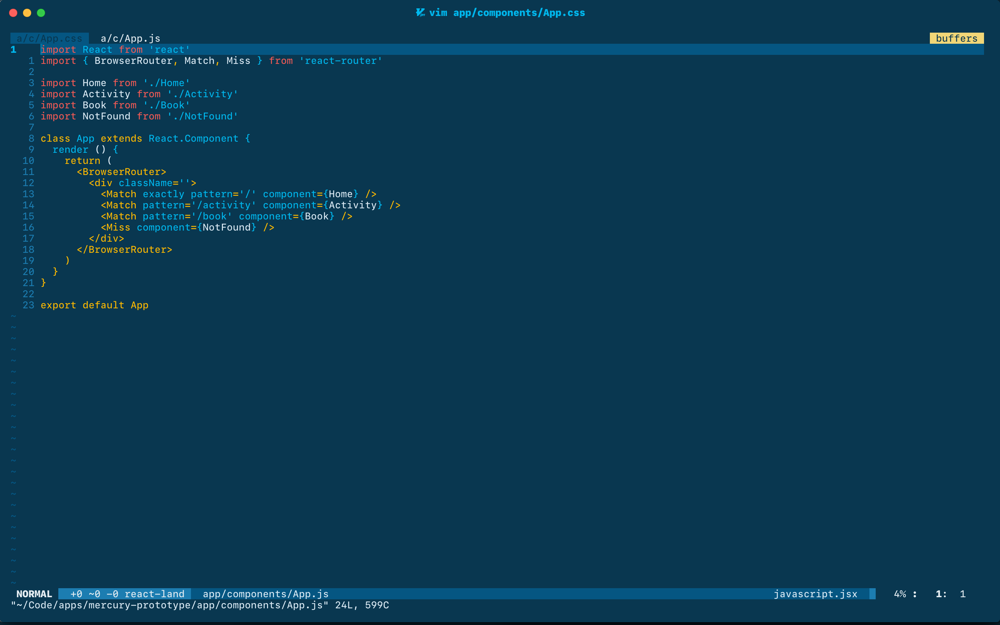
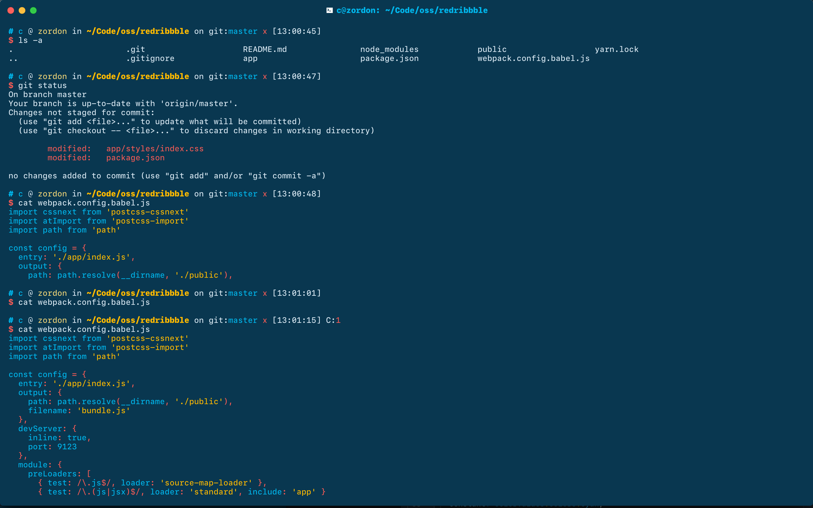

# Ganymede

<a href="https://github.com/charlespeters/VVWIP">
  
</a>

A color scheme for Hyper/Hyperterm, Vim/NeoVim & Atom (maybe, eventually, probably...) inspired by the icy coldness of the moons of Jupiter contrasted against all the bright vibrant colors that my personality comprises.


## Usage

```
npm i -S ganymede
```

<div align='center'>

### Vim
</div>

This was designed using Neovim Add `charlespeters/vim-ganymede` to whatever plugin system you're using (Pathogen, Vundle, etc). In your `.vimrc` add:

```vim
set t_Co=256
colorscheme ganymede

let g:airline_theme='ganymede'
```



<div align='center'>

### Hyper
</div>


Add `'hyperganymede'` under plugins in your configuration file (preferably toward the end of the list). An example:

```js
module.exports = {
  config: {
    fontFamily: 'SFMono-Medium',
    cursorShape: 'BEAM',
    bell: false,
    ...
  },
  plugins: {
    'hyperganymede'
  }
}
```

And in action:



---

## Acknowledgement

I probably wouldn't have built this if [Trevor Miller](https://twitter.com/trevordmiller) hadn't paved the way with his [Nova Project](http://www.trevordmiller.com/nova/). Trevor you're awesome, 🍻⚡️🎉.

## License

MIT
