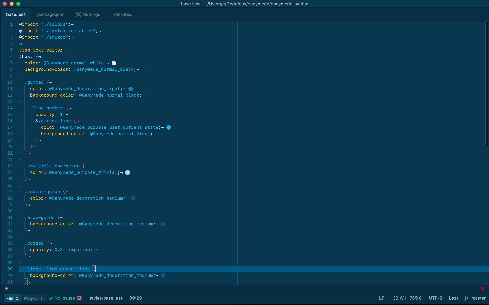

# Ganymede

<a href="https://github.com/charlespeters/VVWIP">
  
</a>

A color scheme for Hyper/Hyperterm, Vim/NeoVim & Atom (maybe, eventually, probably...) inspired by the icy coldness of the moons of Jupiter contrasted against all the bright vibrant colors that my personality comprises.


## Usage

```shell
npm i -S ganymede
```

<h3 align='center'>
  
  <br />
  <a href='https://github.com/charlespeters/ganymede.vim'>Vim</a>
</h3>

This was designed using Neovim, but totally works in normal people Vim (like 7.4+). Add `charlespeters/vim-ganymede` to whatever plugin system you're using (Pathogen, Vundle, etc). In your `.vimrc` add:

```vim
set t_Co=256
colorscheme ganymede

let g:airline_theme='ganymede'
```


<h3 align='center'>
  
  <br />
  <a href='https://github.com/charlespeters/hyperganymede'>Hyper</a>
</h3>


Add `'hyperganymede'` under plugins in your configuration file (preferably toward the end of the list). An example:

```js
module.exports = {
  config: {
    fontFamily: 'SFMono-Medium',
    cursorShape: 'BEAM',
    bell: false,
    ...
  },
  plugins: {
    'hyperganymede'
  }
}
```

And in action:


<h3 align='center'>
  
  <br />
  <a href='https://github.com/charlespeters/ganymede-atom-syntax'>Atom</a>
</h3>

There's a syntax port of Ganymede for Atom. To install, run this command below or search for Ganymede.

```
apm install ganymede-atom-syntax
```



The screenshot above uses Atom Dark UI theme and SF Mono.

<h3 align='center'>
  
  <br />
  <a href='https://github.com/charlespeters/ganymede-iterm'>iTerm</a>
</h3>

Download [`Ganymede.itermcolors`](https://raw.githubusercontent.com/charlespeters/ganymede-iterm/master/Ganymede.itermcolors) and drag into onto iTerm in your Dock or In iTerm, open your preferences
navigate to _"Profiles" > "Colors" > "Color Presets" > "Import"_ and select the copy of `Ganymede.itermcolors` you downloaded.

---

## Acknowledgement

I probably wouldn't have built this if [Trevor Miller](https://twitter.com/trevordmiller) hadn't paved the way with his [Nova Project](http://www.trevordmiller.com/nova/). Trevor you're awesome, 🍻⚡️🎉.

## License

MIT
